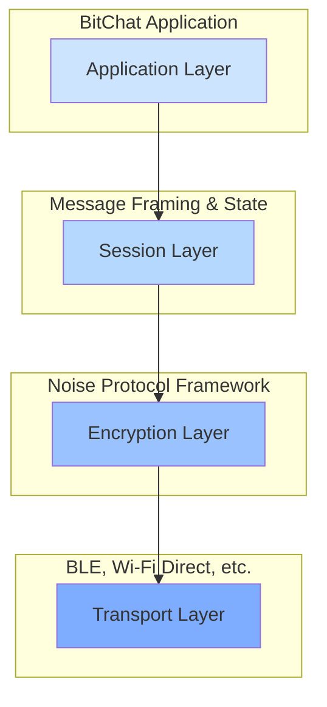
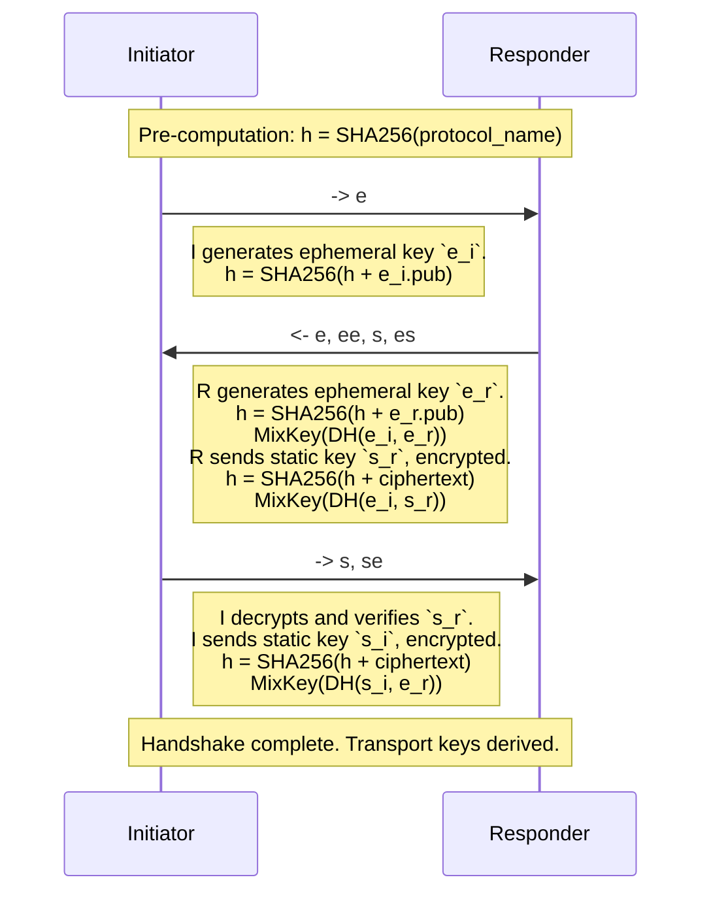

# BitChat Protocol Whitepaper

**Version 1.1**

**Date: July 25, 2025**

---

## Abstract

BitChat is a decentralized, peer-to-peer messaging application designed for secure, private, and censorship-resistant communication over ephemeral, ad-hoc networks. This whitepaper details the BitChat Protocol Stack, a layered architecture that combines a modern cryptographic foundation with a flexible application protocol. At its core, BitChat leverages the Noise Protocol Framework (specifically, the `XX` pattern) to establish mutually authenticated, end-to-end encrypted sessions between peers. This document provides a technical specification of the identity management, session lifecycle, message framing, and security considerations that underpin the BitChat network.

---

## 1. Introduction

In an era of centralized communication platforms, BitChat offers a resilient alternative by operating without central servers. It is designed for scenarios where internet connectivity is unavailable or untrustworthy, such as protests, natural disasters, or remote areas. Communication occurs directly between devices over transports like Bluetooth Low Energy (BLE).

The design goals of the BitChat Protocol are:

*   **Confidentiality:** All communication must be unreadable to third parties.
*   **Authentication:** Users must be able to verify the identity of their correspondents.
*   **Integrity:** Messages cannot be tampered with in transit.
*   **Forward Secrecy:** The compromise of long-term identity keys must not compromise past session keys.
*   **Deniability:** It should be difficult to cryptographically prove that a specific user sent a particular message.
*   **Resilience:** The protocol must function reliably in lossy, low-bandwidth environments.

This paper specifies the technical details of the protocol designed to meet these goals.

---

## 2. Protocol Stack

The BitChat Protocol is a four-layer stack. This layered approach separates concerns, allowing for modularity and future extensibility.

*   **Application Layer:** Defines the structure of user-facing messages (`BitchatMessage`), acknowledgments (`DeliveryAck`), and other application-level data.
*   **Session Layer:** Manages the overall communication packet (`BitchatPacket`). This includes routing information (TTL), message typing, fragmentation, and serialization into a compact binary format.
*   **Encryption Layer:** Establishes and manages secure channels using the Noise Protocol Framework. It is responsible for the cryptographic handshake, session management, and transport message encryption/decryption.
*   **Transport Layer:** The underlying physical medium used for data transmission, such as Bluetooth Low Energy (BLE). This layer is abstracted away from the core protocol.

---

## 3. Identity and Key Management

A peer's identity in BitChat is defined by two persistent cryptographic key pairs, which are generated on first launch and stored securely in the device's Keychain.

1.  **Noise Static Key Pair (`Curve25519`):** This is the long-term identity key used for the Noise Protocol handshake. The public part of this key is shared with peers to establish secure sessions.
2.  **Signing Key Pair (`Ed25519`):** This key is used to sign announcements and other protocol messages where non-repudiation is required, such as binding a public key to a nickname.

### 3.1. Fingerprint

A user's unique, verifiable fingerprint is the **SHA-256 hash** of their **Noise static public key**. This provides a user-friendly and secure way to verify an identity out-of-band (e.g., by reading it aloud or scanning a QR code).

`Fingerprint = SHA256(StaticPublicKey_Curve25519)`

### 3.2. Identity Management

The `SecureIdentityStateManager` class is responsible for managing all cryptographic identity material and social metadata (petnames, trust levels, etc.). It uses an in-memory cache for performance and persists this cache to the Keychain after encrypting it with a separate AES-GCM key.

---

## 4. The Social Trust Layer

Beyond cryptographic identity, BitChat incorporates a social trust layer, allowing users to manage their relationships with peers. This functionality is handled by the `SecureIdentityStateManager`.

### 4.1. Peer Verification

While the Noise handshake cryptographically authenticates a peer's key, it doesn't confirm the real-world identity of the person holding the device. To solve this, users can perform out-of-band (OOB) verification by comparing fingerprints. Once a user confirms that a peer's fingerprint matches the one they expect, they can mark that peer as "verified". This status is stored locally and displayed in the UI, providing a strong assurance of identity for future conversations.

### 4.2. Favorites and Blocking

To improve the user experience and provide control over interactions, the protocol supports:
*   **Favorites:** Users can mark trusted or frequently contacted peers as "favorites." This is a local designation that can be used by the application to prioritize notifications or display peers more prominently.
*   **Blocking:** Users can block peers. When a peer is blocked, the application will discard any incoming packets from that peer's fingerprint at the earliest possible stage, effectively silencing them without notifying the blocked peer.

---

## 5. The Noise Protocol Layer

BitChat implements the Noise Protocol Framework to provide strong, authenticated end-to-end encryption.

### 5.1. Protocol Name

The specific Noise protocol implemented is:

**`Noise_XX_25519_ChaChaPoly_SHA256`**

*   **`XX` Pattern:** This handshake pattern provides mutual authentication and forward secrecy. It does not require either party to know the other's static public key before the handshake begins. The keys are exchanged and authenticated during the three-part handshake. This is ideal for a decentralized P2P environment.
*   **`25519`:** The Diffie-Hellman function used is Curve25519.
*   **`ChaChaPoly`:** The AEAD (Authenticated Encryption with Associated Data) cipher is ChaCha20-Poly1305.
*   **`SHA256`:** The hash function used for all cryptographic hashing operations is SHA-256.

### 5.2. The `XX` Handshake

The `XX` handshake consists of three messages exchanged between an Initiator and a Responder to establish a shared secret and derive transport encryption keys.

**Handshake Flow:**

1.  **Initiator -> Responder:** The initiator generates a new ephemeral key pair (`e_i`) and sends the public part to the responder.
2.  **Responder -> Initiator:** The responder receives the initiator's ephemeral public key. It then generates its own ephemeral key pair (`e_r`), performs a DH exchange with the initiator's ephemeral key (`ee`), sends its own static public key (`s_r`) encrypted with the resulting symmetric key, and performs another DH exchange between the initiator's ephemeral key and its own static key (`es`).
3.  **Initiator -> Responder:** The initiator receives the responder's message, decrypts the responder's static key, and authenticates it. The initiator then sends its own static key (`s_i`) encrypted and performs a final DH exchange between its static key and the responder's ephemeral key (`se`).

Upon completion, both parties share a set of symmetric keys for bidirectional transport message encryption. The final handshake hash is used for channel binding.

### 5.3. Session Management

The `NoiseSessionManager` class manages all active Noise sessions. It handles:
*   Creating sessions for new peers.
*   Coordinating the handshake process to prevent race conditions.
*   Storing the resulting transport ciphers (`sendCipher`, `receiveCipher`).
*   Periodically checking if sessions need to be re-keyed for enhanced security.

---

## 6. The BitChat Session and Application Protocol

Once a Noise session is established, peers exchange `BitchatPacket` structures, which are encrypted as the payload of Noise transport messages.

### 6.1. Binary Packet Format (`BitchatPacket`)

To minimize bandwidth, `BitchatPacket`s are serialized into a compact binary format. The structure is designed to be fixed-size where possible to resist traffic analysis.

| Field           | Size (bytes) | Description                                                                                             |
|-----------------|--------------|---------------------------------------------------------------------------------------------------------|
| **Header**      | **13**       | **Fixed-size header**                                                                                   |
| Version         | 1            | Protocol version (currently `1`).                                                                       |
| Type            | 1            | Message type (e.g., `message`, `deliveryAck`, `noiseHandshakeInit`). See `MessageType` enum.            |
| TTL             | 1            | Time-To-Live for mesh network routing. Decremented at each hop.                                         |
| Timestamp       | 8            | `UInt64` millisecond timestamp of packet creation.                                                      |
| Flags           | 1            | Bitmask for optional fields (`hasRecipient`, `hasSignature`, `isCompressed`).                           |
| Payload Length  | 2            | `UInt16` length of the payload field.                                                                   |
| **Variable**    | **...**      | **Variable-size fields**                                                                                |
| Sender ID       | 8            | 8-byte truncated peer ID of the sender.                                                                 |
| Recipient ID    | 8 (optional) | 8-byte truncated peer ID of the recipient. Present if `hasRecipient` flag is set. Broadcast if `0xFF..FF`. |
| Payload         | Variable     | The actual content of the packet, as defined by the `Type` field.                                       |
| Signature       | 64 (optional)| `Ed25519` signature of the packet. Present if `hasSignature` flag is set.                               |

**Padding:** All packets are padded to the next standard block size (256, 512, 1024, or 2048 bytes) using a PKCS#7-style scheme to obscure the true message length from network observers.

### 6.2. Application Message Format (`BitchatMessage`)

For packets of type `message`, the payload is a binary-serialized `BitchatMessage` containing the chat content.

| Field               | Size (bytes) | Description                                                              |
|---------------------|--------------|--------------------------------------------------------------------------|
| Flags               | 1            | Bitmask for optional fields (`isRelay`, `isPrivate`, `hasOriginalSender`). |
| Timestamp           | 8            | `UInt64` millisecond timestamp of message creation.                      |
| ID                  | 1 + len      | `UUID` string for the message.                                           |
| Sender              | 1 + len      | Nickname of the sender.                                                  |
| Content             | 2 + len      | The UTF-8 encoded message content.                                       |
| Original Sender     | 1 + len (opt)| Nickname of the original sender if the message is a relay.               |
| Recipient Nickname  | 1 + len (opt)| Nickname of the recipient for private messages.                          |

---

## 7. Message Routing and Propagation

BitChat operates as a decentralized mesh network, meaning there are no central servers to route messages. Packets are propagated through the network from peer to peer. The protocol supports several modes of message delivery.

### 7.1. Direct Connection

This is the simplest case. If Peer A and Peer B are directly connected, they can exchange packets after establishing a mutually authenticated Noise session. All packets are encrypted using the transport ciphers derived from the handshake.

### 7.2. Efficient Gossip with Bloom Filters

To send messages to peers that are not directly connected, BitChat employs a "flooding" or "gossip" protocol. When a peer receives a packet that is not destined for it, it acts as a relay. To prevent infinite routing loops and minimize memory usage, the protocol uses an `OptimizedBloomFilter` to track recently seen packet IDs.

The logic is as follows:

1.  A peer receives a packet.
2.  It checks the Bloom filter to see if the packet's ID has likely been seen before. If so, the packet is discarded. Bloom filters can have false positives (though they are rare), but they guarantee no false negatives. This means that while some packets may be incorrectly discarded due to false positives, the gossip protocol's redundancy ensures these packets will eventually be received through subsequent exchanges with other peers.
3.  If the packet is new, its ID is added to the Bloom filter.
4.  The peer decrements the packet's Time-To-Live (TTL) field.
5.  If the TTL is greater than zero, the peer re-broadcasts the packet to all of its connected peers, *except* for the peer from which it received the packet.

This mechanism allows packets to "flood" through the network efficiently, maximizing the chance of reaching their destination while using minimal resources to prevent loops.

### 7.3. Time-To-Live (TTL)

Every `BitchatPacket` contains an 8-bit TTL field. This value is set by the originating peer and is decremented by one at each relay hop. If a peer receives a packet and decrements its TTL to 0, it will process the packet (if it is the recipient) but will not relay it further. This is a crucial mechanism to prevent packets from circulating endlessly in the mesh.

### 7.4. Private vs. Broadcast Messages

The routing logic respects the confidentiality of private messages:

*   **Private Messages:** A packet with a specific `recipientID` is a private message. Relay nodes forward the entire, encrypted Noise message without being able to access the inner `BitchatPacket` or its payload. Only the final recipient, who shares the correct Noise session keys with the sender, can decrypt the packet.
*   **Broadcast Messages:** A packet with the special broadcast `recipientID` (`0xFFFFFFFFFFFFFFFF`) is intended for all peers. Any peer that receives and decrypts a broadcast message will process its content. It will still be relayed according to the flooding algorithm to ensure it reaches the entire network.

### 7.5. Message Reliability and Lifecycle

To function in unreliable, lossy networks, the protocol includes features to track the lifecycle of a message and ensure its delivery.

*   **Delivery Acknowledgments (`DeliveryAck`):** When a private message reaches its final destination, the recipient's device sends a `DeliveryAck` packet back to the original sender. This acknowledgment contains the ID of the original message.
*   **Read Receipts (`ReadReceipt`):** After a message is displayed on the recipient's screen, the application can send a `ReadReceipt`, also containing the original message ID, to inform the sender that the message has been seen.
*   **Message Retry Service:** Senders maintain a `MessageRetryService` which tracks outgoing messages. If a `DeliveryAck` is not received for a message within a certain time window, the service will automatically re-send the message, creating a more resilient user experience.

### 7.6. Fragmentation

Transport layers like BLE have a Maximum Transmission Unit (MTU) that limits the size of a single packet. To handle messages larger than this limit, BitChat implements a fragmentation protocol.

*   **`fragmentStart`:** A packet with this type marks the beginning of a fragmented message. It contains metadata about the total size and number of fragments.
*   **`fragmentContinue`:** These packets carry the intermediate chunks of the message data.
*   **`fragmentEnd`:** This packet carries the final chunk of the message and signals the receiver to begin reassembly.

Receiving peers collect all fragments and reassemble them in the correct order before passing the complete message up to the application layer.

---

## 8. Security Considerations

*   **Replay Attacks:** The Noise transport messages include a nonce that is incremented for each message. The `NoiseCipherState` implements a sliding window replay protection mechanism to detect and discard replayed or out-of-order messages.
*   **Denial of Service:** The `NoiseRateLimiter` is implemented to prevent resource exhaustion from rapid, repeated handshake attempts from a single peer.
*   **Key-Compromise Impersonation:** The `XX` pattern authenticates both parties, preventing an attacker from impersonating one party to the other.
*   **Identity Binding:** While the Noise handshake authenticates the cryptographic keys, binding those keys to a human-readable nickname is handled at the application layer. Users must verify fingerprints out-of-band to prevent man-in-the-middle attacks.
*   **Traffic Analysis:** The use of fixed-size padding for all packets helps to obscure the exact nature and content of the communication, making it harder for a network-level adversary to infer information based on message size.

---

## 9. Conclusion

The BitChat Protocol provides a robust and secure foundation for decentralized, peer-to-peer communication. By layering a flexible application protocol on top of the well-regarded Noise Protocol Framework, it achieves strong confidentiality, authentication, and forward secrecy. The use of a compact binary format and thoughtful security considerations like rate limiting and traffic analysis resistance make it suitable for use in challenging network environments.
